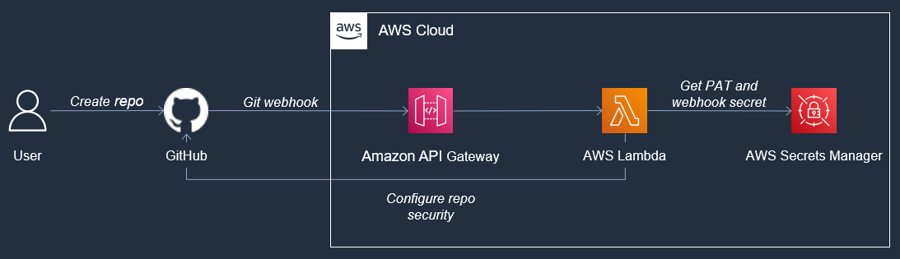

# GitHub webhook to AWS Lambda function example

## Overview

The purpose of this repo is to demonstrate the setup and architecture needed to send [GitHub webhooks](https://docs.github.com/en/developers/webhooks-and-events/webhooks/about-webhooks) to [AWS Lambda](https://aws.amazon.com/lambda/) functions for processing.

In this example, the goal is for Lambda to perform the following any time a new repository is created in a [GitHub organization](https://docs.github.com/en/organizations/collaborating-with-groups-in-organizations/about-organizations):

1. Create a default branch, if non exists
   1. Commit a placeholder [`README.md`](./webhook-cdk/lambda/README.md) to the branch
2. Enforce code reviews (CR) on the default branch
3. Require a pull request (PR) before merging
4. Require 1 approval on any PR
5. Create an issue in the repo noting what was enabled

## Solution components



### GitHub webhooks

[GitHub Webhooks](https://docs.github.com/en/developers/webhooks-and-events/webhooks/about-webhooks) were chosen based on the following features:

* Rapid and easy integration with existing organizations and repositories
* Event-based triggers when repositories are created

[Serverless GitHub Actions](https://github.com/lambci/serverless-actions) looks promising as well, but as of this commit is not available yet. When that becomes available I will likely refactor this example accordingly.

### AWS Cloud Development Kit (CDK)

The [AWS Cloud Development Kit (CDK)](https://docs.aws.amazon.com/cdk/v2/guide/home.html) lets you build and configure resources in the AWS Cloud using expressive, imperative programming concepts. Unlike declarative Infrastructure as Code, the AWS CDK lets you add considerable flexibility to your application stacks.

To ensure easy deployment and maintenance of this solution, all AWS components have been built into a single CDK app that can be deployed using several command-line interface (CLI) commands.

In this example, the CDK was chosen because of the following advantages:

* Easy to pick up and use for teams with programming knowledge
* Does not require any infrastructure as code experience
* Stores all infrastructure configuration as code in version control
* Reusable across multiple GitHub organizations, customers, regions, etc.

### Amazon API Gateway

GitHub webhooks can be configured to respond to specific events (such as creation of a repository in an organization). When such an event occurs, the details of the event are sent to a specified destination (URL). The destination must be able to receive the event and perform some processing based on the inputs.

In this solution, [Amazon API Gateway](https://aws.amazon.com/api-gateway/) acts as the destination for webhook events. Within the supplied CDK app, a REST API is configured to receive the webhooks and proxy them to AWS Lambda for processing. This solution was chosen due to the limited administrative burden the service places on users. Setup is one-time and highly scalable.

Another option being considered is [Amazon EventBridge](https://aws.amazon.com/eventbridge/), but from some cursory research it doesn't appear to support GitHub webhooks directly (yet). It would still require an API endpoint.

### AWS Lambda

[AWS Lambda](https://aws.amazon.com/lambda/) is used as the backend processing that will enforce the needed security rules on newly-created repositories. When a GitHub webhook is sent to the REST API endpoint, the event data is then proxied to a Lambda function. Functions are effectively containers to run arbitrary code in response to events, without needing to manage the underlying hardware.

This solution was chosen due to the low cost and significantly reduced maintenance compared to managing servers (virtual or otherwise).

## Prerequisites

* An active AWS account
  * If you do not have one, follow [these instructions](https://aws.amazon.com/premiumsupport/knowledge-center/create-and-activate-aws-account/) to create an activate an account
* The AWS CLI installed on your workstation
  * Follow [these instructions](https://docs.aws.amazon.com/cli/latest/userguide/getting-started-install.html) to install and configure the AWS CLI
* The AWS CDK installed on your workstation
  * Follow [these instructions](https://docs.aws.amazon.com/cdk/v2/guide/getting_started.html) to install and configure the AWS CDK
* Docker installed on your workstation
  * Follow [these instructions](https://docs.docker.com/desktop/) to install and configure Docker Desktop

## Setup

### Step 1: Create a personal access token (PAT) and webhook secret

A [personal access token (PAT)](https://docs.github.com/en/authentication/keeping-your-account-and-data-secure/creating-a-personal-access-token) is used to replace a password when making requests to GitHub programmatically.

* **Note:** It is **highly** recommended to do this using a service account. Creating tokens for personal user accounts to configure automation can cause problems over time.

A [webhook secret](https://docs.github.com/en/developers/webhooks-and-events/webhooks/securing-your-webhooks#setting-your-secret-token) can be used to help secure your webhooks and the endpoints that receive them. This is used by GitHub to calculate a signature for the request, which you can compare within your endpoint's code or authentication mechanisms.

1. Follow [these instructions](https://docs.github.com/en/authentication/keeping-your-account-and-data-secure/creating-a-personal-access-token) to grant an access token.
2. Save the token value someplace safe.
3. Make up a password to be used as a webhook secret and store it someplace safe.

### Step 2: Upload the PAT and secret to AWS Secrets Manager

[AWS Secrets Manager](https://aws.amazon.com/secrets-manager/) is used to store secrets or other sensitive information that needs to be used by applications and systems. Using the [Boto3 library](https://aws.amazon.com/sdk-for-python/), the Lambda function that processes the webhook event will query Secrets Manager for the PAT and webhook secret. This removes the need to store these values within your codebase.

1. Follow [these instructions](https://aws.amazon.com/premiumsupport/knowledge-center/sign-in-console/) to sign in to the AWS Management Console.
2. In the search bar at the top of the console, enter `Secrets Manager`

    First, create the secret that will hold the personal access token.

3. Select **Secrets Manager** from the results of the search
4. Select **Store a new secret**
5. Under **Secret type**, select **Other type of secret**
6. Under **Key/value pairs**
   1. In the left input field, enter `github_token`
   2. In the right input field, enter the GitHub Personal Access Token you created previously
7. Select **Next**
8. In the **Secret name** input field, enter `github_token`
9. Select **Next**
10. Select **Next**
11. Select **Store**

    Next, create the secret that will hold the webhook secret.

12. Select **Secrets Manager** from the results of the search
13. Select **Store a new secret**
14. Under **Secret type**, select **Other type of secret**
15. Under **Key/value pairs**
    1. In the left input field, enter `webhook_secret`
    2. In the right input field, enter the webhook secret you created previously
16. Select **Next**
17. In the **Secret name** input field, enter `webhook_secret`
18. Select **Next**
19. Select **Next**
20. Select **Store**

    Lastly, you will need to copy the Amazon Resource Name (ARN) values for both secrets. These will be used by Lambda to get the secret values later.

21. Return to the [Secrets Manager console](https://console.aws.amazon.com/secretsmanager/home?#!/listSecrets/)
22. Open **`webhook_secret`** in a new tab
23. Copy the value of **Secret ARN**
24. In the Secrets Manager console, open **`github_token`** in a new tab
25. Copy the value of **Secret ARN**

### Step 3: Set up the CDK app

To prepare the CDK app for deployment into your AWS account, the two secret ARNs you copied previously need to be added to the app configuration. This can be done quickly by updating two string variables.

1. Clone this repository to your workstation
2. Open [./webhook-cdk/app.py](./webhook-cdk/app.py)
3. On each of the following lines, change the listed value

   | Line Number | Variable name | Replace with... |
   |-------------|---------------|-----------------|
   | 9           | `github_token_arn` | ARN of the **`github_token`** secret you created |
   | 13          | `github_webhook_secret_arn` | ARN of the **`webhook_secret`** secret you created |
   | 17          | `github_user`               | The GitHub user to tag in issues when a repository is created |
   | 21          | `git_email`                 | The email address to associate with the initial README commit |
   | 22          | `git_name`                  | The name to associate with the initial README commit |

4. Save your changes
5. Create a new virtual environment and install the dependencies
   
   ```bash
   python -m venv .venv
   source .venv/bin/activate
   pip install -r requirements.txt
   ```

### Step 4: Deploy the CDK app

In this step, you will deploy your CDK app to your AWS account.

1. Run the following command from the command line or terminal from within the `webhook-cdk` repository (make sure to change the output path to a path on your workstation)

    ```bash
    cdk deploy --outputs-file /path/to/cdk-outputs.json 
    ```

2. Confirm that the CDK will create the listed resources
3. Once the command completes, open `cdk-outputs.json` file
4. Make note of the `PayloadURL` output

### Step 5: Create a GitHub webhook

1. Navigate to [GitHub.com](https://github.com/)
2. Open your organization
3. Select the **Settings** tab
4. Under *Code, planning, and automation*, select **Webhooks**
5. Select **Add webhook**
6. In the **Payload URL** input field, enter the `PayloadURL` value you copied from `cdk-outputs.json`
7. In the **Content type** drop-down menu, select **`application/json`**
8. In the **Secret** input field, enter the webhook secret you created previously
9. Under *Which events would you like to trigger this webhook?*, select **Let me select individual events.**
10. In the events:
    1. Deselect **Pushes**
    2. Select **Repositories**
11. Select **Add webhook**

### Step 6: Verify

As a final step, test creating a repository in your organization. Shortly after doing so, the following should occur.

1. An initial default branch is created with the placeholder [`README.md`](./webhook-cdk/lambda/README.md) file
2. Protection is enabled for the default branch
3. An issue is created outlining the protections that have been configured

## Dependencies

This project makes use of the following dependencies:

* [Boto3](https://aws.amazon.com/sdk-for-python/)
